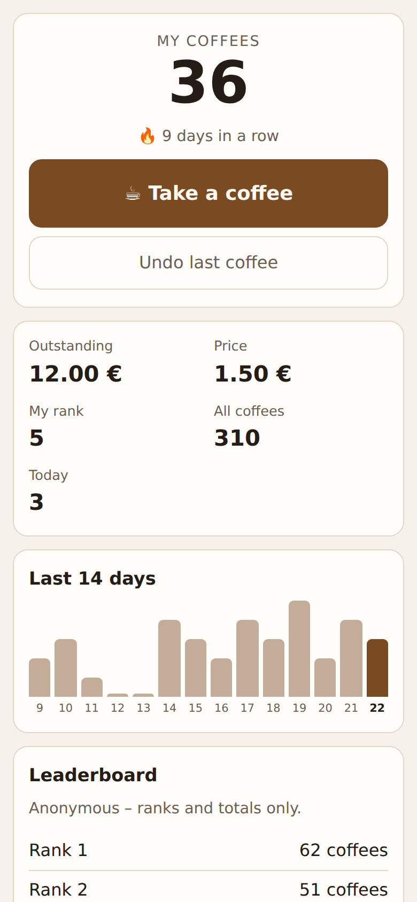
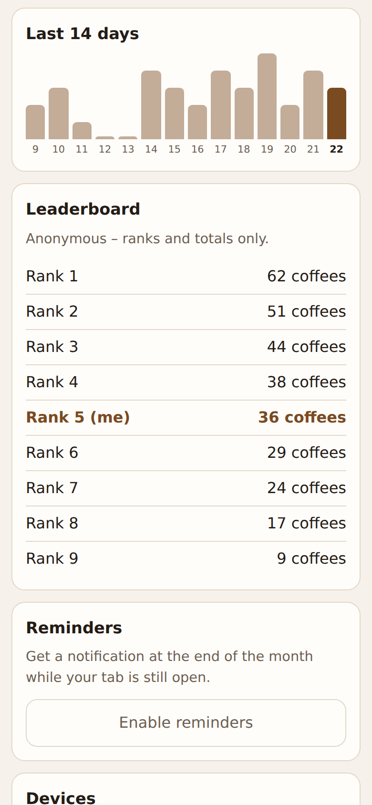
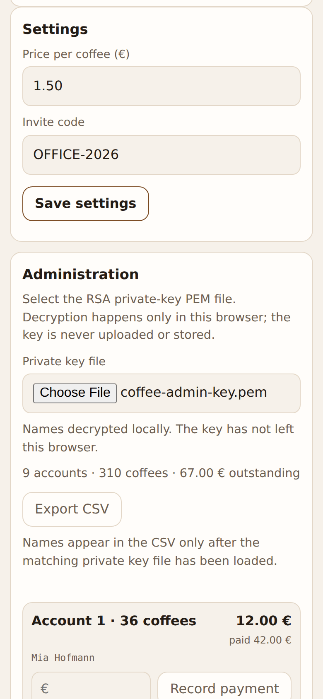

# ☕ Coffee Time

[](https://github.com/marcomattes/coffetime/actions/workflows/ci.yml)
[](LICENSE)
[](composer.json)

**A privacy-first, installable PWA for the shared office coffee tab.** Everyone signs in with a passkey and tracks their own coffees; names and individual totals stay private, and only anonymous aggregate statistics are ever shared. The server stores names exclusively as ciphertext it cannot decrypt — the admin's private key never leaves the admin's browser.

Built to run anywhere PHP runs: no framework, no Node runtime in production, SQLite by default. `composer install`, point a web root at `public/`, done.

<p align="center">
  
  
  
</p>

## Highlights

**Authentication & accounts**
- Passwordless, username-less WebAuthn login with discoverable passkeys — no emails, no passwords for regular accounts.
- Device linking: a signed-in device generates a short-lived code to add a passkey on a new device.
- Admin-issued recovery codes for users who lost every device. Codes are single-use; only their hash is stored.
- The first account ever registered becomes administrator automatically.
- Optional password sign-in **for administrators only**, for managed workstations where passkeys are blocked. Opt-in, set by the admin on their own account, and removable again; everyone else stays passkey-only. See [Administrator password](#administrator-password).
- Invitation links: `https://your-host/?invite=CODE` prefills the invite code, so nobody has to retype it.

**Privacy by construction**
- Names are encrypted in the browser-facing API with the administrator's RSA public key; the server holds no private key and no decryption code.
- The admin screen decrypts names **locally with Web Crypto** from a selected private-key file (never uploaded, never persisted), including CSV export.
- Rankings are anonymous; each user sees only their own totals and history.

**Bookkeeping that holds up**
- Server-authoritative counter with a time-boxed undo (default 5 minutes — enough for a mis-tap, not enough to edit the tab), balances, streaks, and a personal 28-day history with chart.
- Every booking freezes the price at booking time — later price changes never reprice existing coffees.
- Admins get their own navigation: the counter, the user list and settings are three pages — a sidebar on a wide screen, a tab row on a phone — and the open page is in the URL, so a reload stays put.
- Admin payments settle tabs; an offline CLI (with optional XLSX export) covers accounting.
- Optional "Pay with PayPal" button: a plain PayPal.me link with the outstanding amount filled in, configured by the admin. It moves no balance on its own — the admin books the payment once the money has arrived.

**Offline-capable PWA**
- Installable app with shortcuts, NFC links, and an app badge that flags a waiting reminder and clears itself the moment the app is opened. An in-app card offers the browser's install prompt, or the Share-sheet steps on iOS, which has no install API.
- NFC tags written from the admin area: the booking link and the registration link go onto a sticker straight from the app on Chrome for Android (Web NFC); every other browser still shows both URLs to copy.
- The footer names the deployed build (short commit hash), read live from the server rather than from the cached shell; a double tap on it clears every cache and reloads.
- Built for the installed app, not just the tab: safe-area-aware layout so nothing hides behind a notch or home indicator, and pull to refresh where there is no reload button.
- Offline booking queue: coffees booked without a connection are queued on the device and retried with an idempotent event ID — never double-counted.
- Local payment reminders without a push server: an opt-in month-end notification while the tab is open, plus an admin "Remind" button. No VAPID keys, no subscriptions, no third party.

**Operations**
- Deleting an account for good, from the user list: the row, its passkeys, sessions and bookings go together, which also frees the name for registration again. An open tab does not block it, but the confirmation says how much is being written off.
- First-run setup wizard: the admin keypair is generated in the browser, the private key is only offered for download, and price/invite code are stored without touching `config.php`.
- In-app admin settings for price and invite code at runtime.
- SQLite by default, optional MySQL/MariaDB; automatic, additive migrations on both.
- TypeScript frontend compiled to plain JavaScript that the PHP server ships as static files.

## Quick start

```bash
composer install
PHP_CLI_SERVER_WORKERS=4 php -S 127.0.0.1:8123 -t public
```

Open <http://localhost:8123> and follow the setup wizard: it generates the admin RSA keypair in your browser, has you download the private key, and asks for a price and invite code. The first account you register afterwards becomes administrator. No manual `config.php` editing is required to get started.

The wizard asks for a **setup token** first. The server prints it to the error log on first contact and stores it in `setup-token.txt` next to the database (`data/` by default) — read it from either. Setup is unauthenticated by necessity and fixes the RSA key every name is sealed to, so without this anyone who reached a freshly uploaded instance before you could claim it. See [First-run setup token](ARCHITECTURE.md#first-run-setup-token).

### Docker

```bash
docker compose up --build
```

Open <http://localhost:8123> and follow the setup wizard as above; read the setup token with `docker compose logs | grep 'setup token'`. The SQLite database and the setup token persist in the `coffee-data` named volume, mounted at `/var/www/html/data` — that directory sits outside the document root, so neither is reachable over HTTP.

The image ships no `config.php` at all: `origin` and `rpId` are derived from the request, which is what lets the same image serve localhost and your own domain without a rebuild. To pin them — which you should for anything past localhost — bind-mount your own file over `/var/www/html/config.php` (see the commented-out example in `compose.yaml`). Set `rpId` to the host without a port and `origin` to the complete origin. Production WebAuthn deployments require HTTPS.

### Run the published image

Every green build on `main` publishes a multi-architecture image (`linux/amd64`, `linux/arm64`) to the GitHub Container Registry:

```bash
docker run -d -p 8123:80 -v coffee-data:/var/www/html/data \
  ghcr.io/marcomattes/coffetime:latest
docker logs $(docker ps -lq) 2>&1 | grep 'setup token'
```

| Tag | Points at |
| --- | --- |
| `latest` | the newest released version |
| `1.2.3`, `1.2`, `1` | a specific release, from a `v1.2.3` git tag |
| `edge` | the latest commit on `main` |
| `sha-abc1234` | one exact commit |

`latest` and the semver tags only move when a `v*` tag is pushed; `edge` moves with `main`. Pin a semver tag in production and treat `edge` as a preview. The footer and `GET /api/version` report the commit the image was built from, so you can tell what is actually running.

Images are built by [`.github/workflows/docker.yml`](.github/workflows/docker.yml) only after the full test suite passes, and carry a signed build provenance attestation:

```bash
gh attestation verify oci://ghcr.io/marcomattes/coffetime:latest --owner marcomattes
```

### Manual configuration (advanced / production)

The wizard is optional. For a scripted or production deployment, copy `config.example.php` to `config.php` and fill it in ahead of time, still using the offline keygen:

```bash
cp config.example.php config.php
php tools/decrypt-users.php --genkey
# Copy admin-public.pem into adminPublicKey in config.php.
# Store admin-private.pem safely and never upload it to the server.
```

If `config.php` already sets `adminPublicKey`, the setup wizard is skipped. Once any of `priceCents`, `invite`, `adminPublicKey`, or `namePepper` has been set through the app (wizard or settings screen), the stored value takes precedence over `config.php` on every later request — see [Settings precedence](#settings-precedence).

## Configuration

`config.php` returns an array. Important settings are `priceCents`, `invite`, `paypalHandle`, `admins` (user IDs as strings), `rpId`, `origin`, `dbPath` (or `db`, see [Database](#database)), `adminPublicKey`, and the secret `namePepper`. Keep the SQLite database and all private keys outside `public/`.

Three optional settings matter for real deployments:

- **`trustedProxyHops`** (default `1`) — how many proxies sit in front of the app. `X-Forwarded-For` is read this many entries from the *right*, because a proxy only appends: anything already in the header came from the caller. Setting it higher than your real chain selects a caller-supplied entry again and un-throttles every per-caller rate limit. Only consulted when `trustProxy` is on.
- **`setupToken`** (default empty) — pins the first-run setup token instead of letting the server generate one. Only useful for scripted deployments; read from `config.php` only.
- **`trustProxy`** (default `false`) — set it only when a reverse proxy sets the `X-Forwarded-*` headers itself. A TLS-terminating proxy otherwise looks like plain HTTP to PHP, which downgrades a *derived* origin to `http://` and drops the session cookie's `Secure` flag. Pinning `origin` and `rpId` explicitly is still the more robust fix.
- **`dayOffsetMinutes`** (default `0`) — the day boundary for streaks, the history chart and the month-end reminder, in minutes east of UTC. `0` keeps days ending at UTC midnight; set it to your office's standard offset (Berlin winter = `60`) so a late-evening coffee counts for the day it was actually had. A fixed offset does not follow daylight saving time.
- **`undoWindowSeconds`** (default `300`, clamped to `30 .. 86400`) — how long a booking can still be taken back. Undo is meant for the mis-tap; past the window the booking stands, the app hides the button, and the endpoint answers `409 undo_expired`. Raise it if your kitchen wants more slack, but do not expect it to be a correction tool for yesterday — that is what the admin screen is for.

`namePepper` must be a real random secret — generate one with `php -r 'echo bin2hex(random_bytes(32)), "\n";'`. The example placeholder is refused at runtime, because `name_hash` is a *keyed fingerprint* of a guessable value (see [Security and privacy](#security-and-privacy)).

The public key must be a PEM-encoded RSA key of at least 4096 bits. New ciphertexts use RSA-OAEP (the SHA-1 OAEP profile supported by PHP OpenSSL and Web Crypto) and carry the `rsa-oaep-sha1:` prefix. Existing X25519 ciphertexts need to be exported with the earlier CLI before upgrading.

### Settings precedence

`priceCents`, `invite`, `paypalHandle`, `adminPublicKey`, and `namePepper` can each be set two ways: in `config.php`, or at runtime through the app (the setup wizard, or the admin settings screen for price, invite and the PayPal handle). Whichever a database `settings` row exists for wins over `config.php`; if no row exists, the `config.php` value (or built-in default) applies. Connection and bootstrap values — `rpId`, `origin`, `dbPath`/`db`, `admins`, `testMode`, `testToken`, `setupToken`, `trustProxy`, `trustedProxyHops` — are read from `config.php` only. `setupToken` in particular: it gates the very request that first writes those settings, so reading it from the database would let the wizard authorize itself.

### Database

SQLite is the default: set `dbPath` to a writable file outside `public/`. To use MySQL or MariaDB instead, add a `db` block:

```php
'db' => [
    'driver' => 'mysql',
    'host' => '127.0.0.1',
    'port' => 3306,
    'database' => 'coffee',
    'user' => 'coffee',
    'password' => 'change-me',
    'charset' => 'utf8mb4',
],
```

An invalid or incomplete `db` block falls back to SQLite. Schema migrations run automatically on both drivers. The offline CLI export (`tools/decrypt-users.php`) reads the SQLite file directly and does not support MySQL; the in-app admin export (decrypt-and-download in the browser) works with either driver, since it goes through the API.

The CLI takes each account's balance from the stored `tab_cents`, which sums every booking at the price frozen when it was made, so its figures match the app after a price change. `--price` is only consulted for a pre-v5 database that has no such column.

## Administration

Add the account ID to `admins` (or rely on the first-registered-user rule), sign in, and select `admin-private.pem` in the Administration section. JavaScript imports it as a non-extractable Web Crypto key and decrypts API ciphertexts in memory. No request containing the key or plaintext names is ever made. From the same screen an administrator can book a payment against a user's tab, export the decrypted roster as CSV — both without the key leaving the browser — and delete an account outright, which is also the only way a name becomes available for registration again.

For a fully offline database export (SQLite only):

```bash
php tools/decrypt-users.php --db ./coffee.sqlite --key ./admin-private.pem --price 150
php tools/decrypt-users.php --db ./coffee.sqlite --key ./admin-private.pem --price 150 --xlsx ./coffee-time.xlsx
```

### Devices and recovery

A signed-in device can generate a link code (valid 15 minutes) to add a passkey on a new device to the same account. An administrator can generate a longer-lived recovery code (60 minutes) for a user who lost every device. Codes are single-use; only their hash is stored, never the plaintext.

Completing an **admin-issued** recovery code also signs that account out everywhere else, so a lost device stops being able to book coffees. A self-issued link code (adding a second device of your own) leaves your other sessions signed in.

### Administrator password

Corporate machines sometimes block WebAuthn outright, which would leave the person who looks after the tab unable to sign in anywhere. An administrator can therefore set a password on **their own** account, under "Password sign-in" in the admin view, and afterwards sign in on the auth screen under "Passkeys blocked on this computer?" with their first name, last name and that password.

Deliberate limits:

- **Administrators only.** There is no way to set a password on another account, and a password on a row without admin rights does not sign in. Everyone else stays passkey-only.
- **Opt-in and reversible.** No password exists until one is set; "Remove password" closes the path again.
- **Passkeys are unaffected.** The password is an addition, never a replacement, and the passkey path keeps working.
- **At least 12 characters**, stored with `password_hash()` (bcrypt via `PASSWORD_DEFAULT`, SHA-256 pre-hashed so nothing is truncated at 72 bytes) — never in plaintext, never recoverable, and never sent back to the browser.
- **Throttled twice**: per caller and per account (`RateLimit::PASSWORD_MAX` / `PASSWORD_ACCOUNT_MAX`), so guessing from a pool of addresses is no cheaper than from one.
- Names stay sealed. Even a leaked admin password does not reveal the roster: names are RSA ciphertext and the private key is never on the server.

The account is found by the same keyed HMAC of the name that duplicate detection uses, since there is no username in the schema — so enter the name exactly as it was registered (surrounding whitespace is normalized, capitalization is not).

If passkeys work on the machine, use them. This exists because for some machines they do not.

### Invitation links

`https://your-host/?invite=CODE` opens the app with the invite code already filled in and the parameter stripped from the URL again. It is a convenience around the same shared invite code the admin settings show — not a second credential and not single-use, so it is only as private as wherever the link was pasted. Changing the invite code in the admin settings invalidates every link carrying the old one.

## Offline use

The service worker caches the app shell for offline start. A coffee booked while offline is queued on the device and retried automatically once the connection returns; the server deduplicates by the booking's event ID (per account), so a retried booking is never counted twice.

The queue belongs to the account that made the bookings: signing out clears it, and an entry can never be flushed under a different account. That matters on the shared kitchen tablet this app is built for. Signing out while offline clears everything locally, but the server-side session can only end once the device is back online — the app says so when that happens.

## Deployment

Point the web root at `public/`, run `composer install --no-dev`, make the database directory writable by PHP, configure HTTPS, and keep `testMode` disabled. Apache rewrite and deny rules are included. Migrations run automatically and are additive.

`./scripts/build-release.sh` assembles a production-only `deploy/` directory with optimized Composer dependencies. GitHub Actions runs the same build after the test suite and deploys pushes to `main` over FTPS. Configure the `FTP_SERVER`, `FTP_USERNAME`, and `FTP_PASSWORD` repository secrets. The optional `FTP_SERVER_DIR`, `FTP_PROTOCOL`, and `FTP_PORT` variables control the destination. The workflow explicitly preserves the server-side `config.php` and `data/` directory.

## Development

### Tests

```bash
php tests/run.php
find public src tests tools -name '*.php' -print0 | xargs -0 -n1 php -l
```

`tests/run.php` runs every standalone `tests/*Test.php` script (unit coverage with no web server, an HTTP integration run against the PHP built-in server, and the encryption tests) and aggregates the results. Each script is also runnable on its own, e.g. `php tests/UnitTest.php`.

By default every test runs against its own throwaway SQLite file. Set `COFFEE_TEST_DB` to a JSON object to run the same suite against MySQL/MariaDB instead:

```bash
COFFEE_TEST_DB='{"driver":"mysql","host":"127.0.0.1","port":3306,"database":"coffee_test","user":"coffee","password":"coffee-pass"}' php tests/run.php
```

The configured database is dropped and recreated before each test phase, so the user in `COFFEE_TEST_DB` needs `DROP`/`CREATE` privileges on it.

End-to-end tests run with Playwright: `npm run test:e2e` (see [e2e/README.md](e2e/README.md)).

### Frontend build

The PWA frontend is written in TypeScript under `frontend/` (`app.ts`, `sw.ts`) and compiled to the plain scripts the server actually ships, `public/app.js` and `public/sw.js`. There is no Node runtime on the production host, so the compiled output is committed to the repository like any other static asset.

```bash
npm ci
npm run build
```

regenerates `public/app.js` and `public/sw.js` from `frontend/`. CI runs the same build and fails if it differs from what is committed, so a stale build never reaches production. Run `npm run check` for a type-check without writing files.

### Dependency policy

Composer resolves dependencies against PHP 8.2 (a `platform` pin in `composer.json`), matching the minimum runtime and CI version. This prevents lock-file updates on newer development machines from silently selecting packages that production cannot install.

### Architecture

Design decisions and invariants — price freezing, the migration model, reminder semantics, link-code lifecycle, the offline queue — are documented in [ARCHITECTURE.md](ARCHITECTURE.md).

## Security and privacy

The database contains IDs, encrypted names, keyed name fingerprints, counters, balances, and passkey material — no email addresses and no passwords. Please report vulnerabilities privately as described in [SECURITY.md](SECURITY.md).

### Where to put `namePepper`

Names are protected two different ways, and only one of them is unconditional:

- `name_encrypted` is sealed with the admin's RSA public key. The private half never touches the server, so a stolen database cannot be decrypted. This holds regardless of configuration.
- `name_hash` is `HMAC-SHA256(namePepper, name)`, used only to reject duplicate registrations. It is a *deterministic fingerprint of a guessable value*: anyone holding both a database copy and the pepper can recover every registered name by hashing candidates from, say, a staff list.

So the two must not live in the same place. Setting `namePepper` in `config.php` keeps it out of database dumps. **The setup wizard has nowhere else to store it and writes it into the `settings` table**, which is convenient but means a database backup carries the key to its own fingerprints. If that matters for your deployment, configure `namePepper` in `config.php` before the first registration — and note that a hardened deployment is likely opening that file anyway, for `origin`, `rpId` and possibly `setupToken`. Encrypted names stay safe either way.

Neither `adminPublicKey` nor `namePepper` can be rotated afterwards — see [Key rotation](ARCHITECTURE.md#key-rotation).

### Backups

Back up the database (the SQLite file, or regular dumps for MySQL/MariaDB) and the admin private key. They protect different things: the database backup restores balances, counters, and history; only the private key can ever decrypt the encrypted names again. **A lost private key makes existing encrypted names permanently unrecoverable** — balances and counters are unaffected, but names are gone for good. Keep `testMode` disabled in production; it exposes reset/seed/clock endpoints guarded only by a shared token.

Do not back up SQLite by copying `coffee.sqlite` while the app is running: the database runs in WAL mode with `synchronous = NORMAL`, so a plain file copy can miss committed transactions that still live in the `-wal` file, and the most recent commits can be lost on power loss. Use SQLite's own consistent snapshot instead:

```bash
sqlite3 data/coffee.sqlite ".backup '/path/to/coffee-backup.sqlite'"
```

For MySQL/MariaDB use `mysqldump --single-transaction`.

## Contributing and license

Contributions are welcome — see [CONTRIBUTING.md](CONTRIBUTING.md). Coffee Time is released under the [MIT License](LICENSE).

Built by [Marco Mattes](https://mattes.dev).
